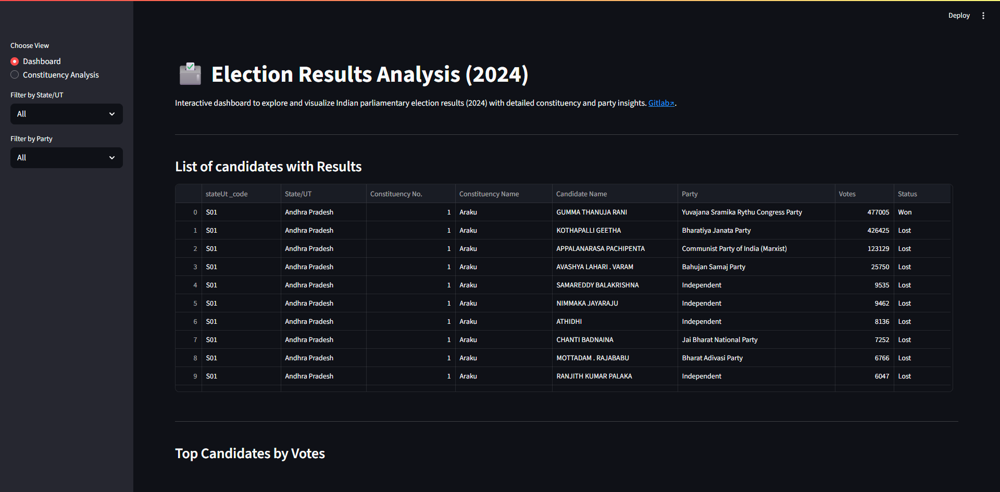

# [Election Result Analyzer](https://electionresult.streamlit.app/)

A Python project to extract, analyze, and visualize election results across constituencies and states. This [dashboard](https://electionresult.streamlit.app/) is designed for researchers, political analysts, and enthusiasts who want quick access to insights from election data.

For detailed [documentation visit](https://cln35h.in/documentation/election-results-dashboard)
---

## Description

This project collects election results from various sources, processes them, and provides useful summaries such as winners, runners-up, NOTA counts, and vote percentages.  

Key Features

- **Comprehensive Election Data Scraping**  
  Automatically scrape and save candidate-wise results and full-page screenshots from the official election results portal for all parliamentary constituencies across India.

- **Structured Data Extraction**  
  Parse raw text data to extract candidate names, parties, votes, and status (Won/Lost/NOTA), and save it into a clean, analysis-ready CSV file.

- **Interactive Dashboard**  
  Explore election results through a user-friendly Streamlit dashboard with dynamic filters for State/UT and Party.

- **Visual Insights**  
  - Bar charts for top candidates by votes  
  - Pie charts for party-wise vote share  
  - State-wise seat wins  
  - Constituency-level vote distributions with winner, runner-up, and NOTA breakdown

- **Detailed Candidate Analysis**  
  View detailed candidate-wise results per constituency, including total votes, margins, and rankings.

- **Cross-platform Compatibility**  
  Works with Python 3.9+ and supports automated Chrome WebDriver setup via `webdriver-manager`.

- **Logs & Screenshots**  
  Automatically saves logs of processed constituencies and screenshots of result pages for reference or verification.

---

## Badges


---

## Visuals

Here’s an example of the output you can get from this project:

  


---

## Installation

### Requirements
- pandas
- requests
- matplotlib
- streamlit

### Steps
1. Clone the repository:
```bash
git clone git@gitlab.com:cln35h/electionresult.git

```

2.  Navigate to the project folder:
    

```bash
cd electionresult

```

3.  Install dependencies:
    

```bash
pip install -r requirements.txt

```


----------

## Support

If you encounter any issues, please send an email regarding them to [journal.cln35h@gmail.com](mailto:journal.cln35h@gmail.com).

----------


## Author

 —***Dinesh aka 学習者 aka cln35h:*** Project owner & main developer


----------

## License

This project is licensed under the MIT License. See LICENSE for details.

----------

## Project Status

Active development. Regular updates and bug fixes will continue as new election data becomes available.
